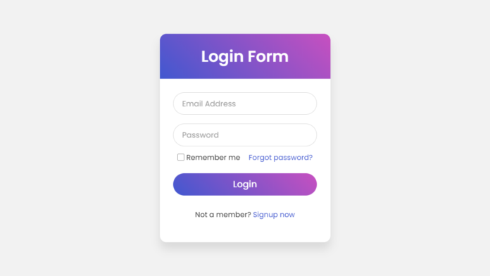

# 📝 Bài Tập HTML/CSS: Tạo Trang Đăng Nhập Có Thông Báo & Giao Diện Đẹp

## 📷 Mẫu Minh Họa



---

## 🎯 Mục Tiêu
- Ôn tập và luyện tập HTML, CSS cơ bản và nâng cao.
- Biết cách dùng JavaScript đơn giản để xử lý sự kiện và hiển thị thông báo.
- Làm quen với **Live Server** trong Visual Studio Code để xem web trực tiếp khi lập trình.

---

## 📌 Yêu Cầu Chức Năng

1. Tạo một form đăng nhập gồm:
   - Ô nhập **Tên đăng nhập (Username)**
   - Ô nhập **Mật khẩu (Password)**
   - Nút **"Đăng nhập"**
2. Khi người dùng bấm nút **"Đăng nhập"**:
   - Nếu một trong hai ô trống → Hiển thị dòng chữ đỏ: `"Vui lòng điền đầy đủ thông tin!"`.
   - (Tùy chọn nâng cao): Nếu nhập đúng `admin` và `123456` → Hiển thị dòng chữ xanh: `"Đăng nhập thành công!"`.

---

## 🎨 Yêu Cầu Giao Diện

- Toàn bộ form cần được **căn giữa màn hình** theo cả chiều dọc và ngang.
- Sử dụng font chữ đẹp từ **Google Fonts** (gợi ý: `'Poppins'`, `'Roboto'`).
- Giao diện đẹp, có bo góc, đổ bóng, và hiệu ứng hover cho nút.
- Giao diện tương thích **cả trên máy tính và điện thoại** (responsive).
- Có thể thêm hình nền mờ, biểu tượng từ **Font Awesome**, hoặc hiệu ứng chuyển động nhẹ nhàng để tăng tính thẩm mỹ.

---

## 🗂 Cấu Trúc Thư Mục Gợi Ý

```
login-form/
├── index.html
├── style.css
└── script.js
```

---

## 🧑‍🏫 Hướng Dẫn Dùng Live Server Trong VS Code

### Bước 1: Cài Live Server
1. Mở **Visual Studio Code**
2. Vào tab **Extensions** (`Ctrl + Shift + X`)
3. Tìm: **Live Server** (tác giả: *Ritwick Dey*) → Bấm **Install**

### Bước 2: Chạy file HTML
1. Nhấp chuột phải vào file `index.html`
2. Chọn **"Open with Live Server"**
3. Trình duyệt sẽ tự mở trang HTML, và tự động cập nhật khi bạn **lưu file** (`Ctrl + S`)

---

## 🌟 Gợi Ý Mở Rộng (Không bắt buộc)

- Thêm nút chuyển đổi **Dark Mode / Light Mode**.
- Thêm hiệu ứng mờ nền khi hiển thị thông báo.
- Tạo hiệu ứng hiển thị mượt khi hiện/ẩn dòng thông báo bằng CSS Transition.
- Chia bố cục rõ ràng bằng **Flexbox** hoặc **Grid**.

---

## 🎁 Gợi Ý Cho Học Sinh

> "Em được tự do sáng tạo giao diện theo phong cách riêng, miễn sao đáp ứng đủ yêu cầu chức năng. Càng đẹp càng tốt. Có thể tìm cảm hứng từ trang login của các website nổi tiếng như Facebook, Google, GitHub,..."
